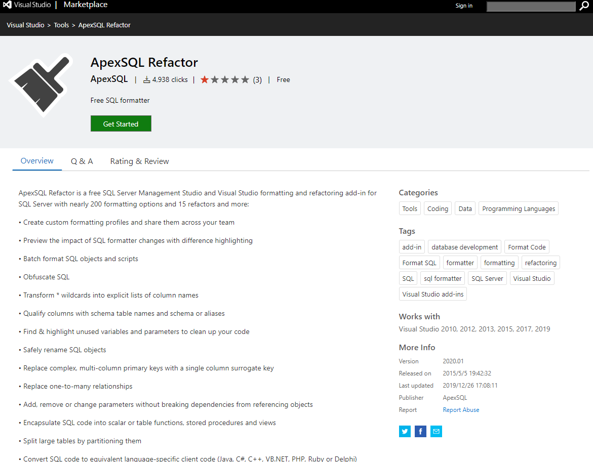
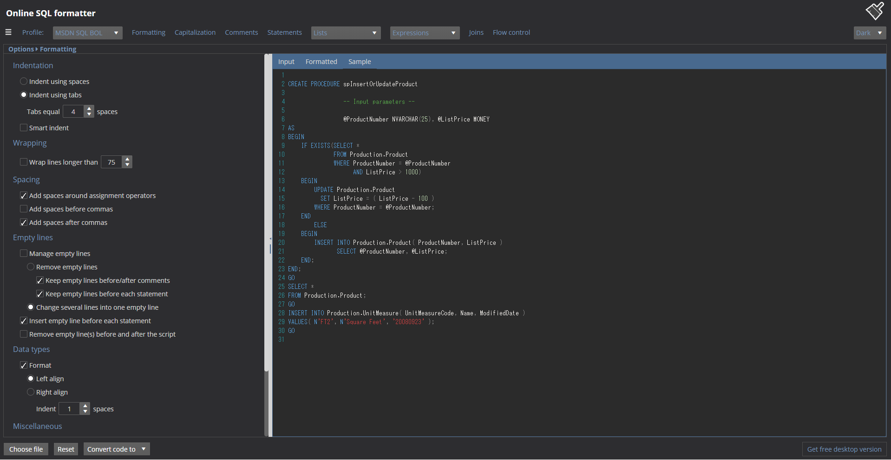

# Visual Studio、および、SQL Server Management StudioにおけるApex SQL Refactor（コードのフォーマット）の概要について

## Apex SQL関連記事

-   Visual Studio、および、SQL Server Management StudioにおけるApex SQL Refactor（コードのフォーマット）の概要について
-   SQLフォーマットのプロファイルの項目説明とサンプルについて

## 概要

本資料にて、Apex SQL RefactorというVisual Studio(VS)、および、SQL Server Management Studio(SSMS)にて利用可能な無料の拡張機能を紹介します。本ツールは多機能でありますが、SQL整形ツールとしての利用を想定してます。

引用元：[Visual Studio Maketplace](https://marketplace.visualstudio.com/items?itemName=vs-publisher-988541.ApexSQLRefactor)のスクリーンショット

## Apex SQL Refactorとは

Visual Studio(VS)、および、SQL Server Management Studio(SSMS)にによるSQL Server開発時に利用可能なフォーマットおよびリファクタリングの拡張機能です。下記のような機能があるようです。

-   SQLのフォーマット
-   カスタムフォーマットのプロファイルの共有
-   フォーマットの一括適応
-   SQLのフォーマット難読化（フォーマットをぐちゃぐちゃにする!?）
-    スキーマテーブル名とスキーマまたはエイリアスで列を修飾
-   使われていない変数やパラメータをハイライトｍクリーンアップ
-   主キーをサロゲートキーに置き換え
-   依存関係を崩さずにパラメータを追加、削除、変更
-   SQLコードを、スカラまたはテーブル関数、ストアドプロシージャ、ビューにカプセル化
-   大きなテーブルを分割
-   SQLコードを同等の言語固有のクライアントコード（Java、C#、C++、VB.NET、PHP、RubyまたはDelphi）に変換

下記サイトより、ダウンロード可能です。

https://www.apexsql.com/sql-tools-refactor.aspx

また、フォーマット機能のみを保持したWebサービスを、Online SQL Formatterとして公開しているようです。

https://sql-formatter.online/options/formatting

引用元：[サイト](https://sql-formatter.online/options/formatting)のスクリーンショット

## Apex SQL Refactor情報源について

以下の記事が、英語ではありますが、参考になります。

| 番号 | 記事名                                                       | 記事概要                                                     |
| ---- | ------------------------------------------------------------ | ------------------------------------------------------------ |
| 1    | [ApexSQL Refactor – Overview]()                              | 機能の全体像が記載されている                                 |
| 2    | [Beautify your SQL code using SQL formatter features](https://solutioncenter.apexsql.com/beautify-your-sql-code-using-sql-formatter-features/) | フォーマットの基本手順が記載されている                       |
| 3    | [How to customize SQL formatting profiles](https://knowledgebase.apexsql.com/customize-sql-formatting-profiles/) | フォーマットプロファイル設定の詳細手順が記載されている       |
| 4    | [Tips and tricks for using ApexSQL Refactor SQL formatting options –  General options, Capitalization and Comments](https://knowledgebase.apexsql.com/tips-tricks-using-apexsql-refactor-sql-formatting-options-general-options-capitalization-comments/) | フォーマットの設定値が記載されている①                        |
| 5    | [Tips and tricks for using ApexSQL Refactor SQL formatting options –  Parameters, Columns, Joins, and Flow control](https://knowledgebase.apexsql.com/tips-tricks-using-apexsql-refactor-sql-formatting-options-schema-statements-data-statements-joins-flow-control/) | フォーマットの設定値が記載されている②                        |
| 6    | [Formatting option mockups and examples](https://knowledgebase.apexsql.com/formatting-option-mockups-examples/) | フォーマットの設定値が記載されている③                        |
| 7    | [ApexSQL Refactor Command Line Interface (CLI) switches](https://knowledgebase.apexsql.com/apexsql-refactor-command-line-interface-cli-switches/) | コマンドラインからフォーマットを実施する方法が記載されている |
| 8    | [SQL formatter and code refactoring articles](https://solutioncenter.apexsql.com/sql-formatter-and-code-refactoring-articles/) | 記事一覧が記載されている                                     |
| 9    | [ApexSQL Refactor knowledgebase](https://knowledgebase.apexsql.com/apexsql-refactor-toc/) | ナレッジ集が記載されている                                   |
| 10   | [FAQs ApexSQL Refactor](https://www.apexsql.com/faqs.aspx?product=ApexSQL_Refactor) | ApexSQLFAQ集が記載されている                                 |

## フォーマットの実施方法について

記事（[Beautify your SQL code using SQL formatter features](https://solutioncenter.apexsql.com/beautify-your-sql-code-using-sql-formatter-features/)）によれば、①表示しているファイルに実施する方法、②特定のフォルダにあるファイルに実施する方法、③コマンドラインから実施する方法があり、柔軟な利用が実施可能です。

1.  表示しているファイルに実施する方法

引用元：[Beautify your SQL code using SQL formatter features](https://solutioncenter.apexsql.com/beautify-your-sql-code-using-sql-formatter-features/)

2.  特定のフォルダにあるファイルに実施する方法

引用元：[Beautify your SQL code using SQL formatter features](https://solutioncenter.apexsql.com/beautify-your-sql-code-using-sql-formatter-features/)

3.  コマンドラインから実施する方法

引用元：[Beautify your SQL code using SQL formatter features](https://solutioncenter.apexsql.com/beautify-your-sql-code-using-sql-formatter-features/)

## 現在の課題について

**課題1 「特定のフォルダにあるファイルに実施する方法」、および、「コマンドラインから実施する方法」を用いる場合に、ファイルのエンコードが「UTF-8」になってしまうこと**

既存のプロジェクトにて、「shift_jis」を標準としている場合に、注意が必要となります。

以上です。

次回以降にて、具体的な利用方法を記載します。