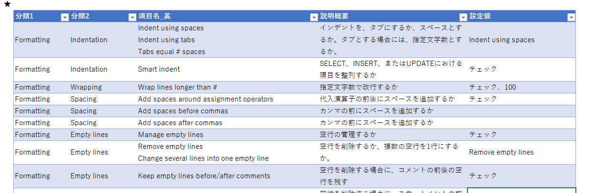
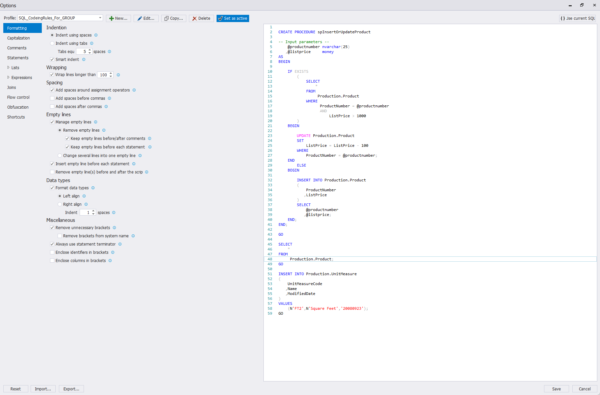

# Apex SQL Refactorによるフォーマットの結果とフォーマットの設定値について


## Apex SQL関連記事

-   Visual Studio、および、SQL Server Management StudioにおけるApex SQL Refactor（コードのフォーマット）の概要について
-   Apex SQL Refactorによるフォーマットの結果とフォーマットの設定値について


## 概要

本資料にて、ベースとしたSQLのコーディングルールを提示したうえでフォーマットの結果を示し、Apex SQL Refactorにおける設定項目の概要を説明します。


引用元：[Visual Studio Maketplace](https://marketplace.visualstudio.com/items?itemName=vs-publisher-988541.ApexSQLRefactor)のスクリーンショット


詳細については、Githubの内容を確認してください。整形検討用サンプルSQLファイル、Apex SQL Refactorの設定ファイル、検討資料を共有します。


## フォーマットの結果について

### SQLにおける基本的なコーディングルール

下記のルールをベースとした、設定値を作成する方法とする。

-   1行を150文字を超えてはならず、可読性を考慮した適切な改行・スペックの追加を実施する。
-   タブを利用せずに、スペックを利用する。
-   予約語、システム関数、変数は大文字とし、データ型は小文字とする。
-   1カラム、1行で記載する。
-   カンマ、算術演算子、条件のAND / ORを用語の前に配置する。ただし、DDL、INSERT文においては、カンマを後に置いてもよく、計算式が長く場合は改行しなくてよい。
-   CASE式においては、WHEN、THEN、ELSEを改行する。
-   サブクエリは字下げする。


### フォーマット後のサンプルについて

フォーマットのサンプルを記載します。コードの整形が自動で実施されることに、とても感動しました。

その他の整形前のコード、整形後のコードについては、Githubで確認してください。コードを難読化する機能があったため、

**整形前**

```sql
------------------------------
--Formattingのサンプルクエリ--
------------------------------

CrEaTE prOCEdurE spInsertOrUpdateProduct /* Input parameters --*/
@productnumber nvarchar(25),@listprice money AS beGIn iF eXISTs(sElECT * FROm
Production.Product WHErE ProductNumber=@productnumber AnD ListPrice>1000) begin
updAtE Production.Product Set ListPrice=ListPrice-100 wHEre ProductNumber=
@productnumber; eND; ELsE BEgIN insERt iNto Production.Product(ProductNumber,
ListPrice) seLECT @productnumber,@listprice; eNd; END;
Go
SelEct * FROm Production.Product;
gO
iNSert intO Production.UnitMeasure(UnitMeasureCode,Name,ModifiedDate) vALUEs(
N'FT2',N'Square Feet','20080923');
go
```

↓

**整形後**

```sql
------------------------------
--Formattingのサンプルクエリ--
------------------------------

CREATE PROCEDURE spInsertOrUpdateProduct

/* Input parameters --*/
    @PRODUCTNUMBER nvarchar(25)
   ,@LISTPRICE     money
AS
BEGIN
    IF EXISTS
        (
            SELECT   
                *
            FROM  
                 Production.Product
            WHERE
                  ProductNumber = @PRODUCTNUMBER
                  AND
                      ListPrice > 1000
        )
    BEGIN
        UPDATE Production.Product
        SET    
            ListPrice = ListPrice - 100
        WHERE    
            ProductNumber = @PRODUCTNUMBER;
    END;
        ELSE
    BEGIN
        INSERT INTO Production.Product
        (
            ProductNumber
           ,ListPrice
        )
        SELECT 
            @PRODUCTNUMBER
           ,@LISTPRICE;
    END;
END;
GO

SELECT  
    *
FROM 
     Production.Product;
GO

INSERT INTO Production.UnitMeasure
(
    UnitMeasureCode
   ,Name
   ,ModifiedDate
)
VALUES
    (N'FT2',N'Square Feet','20080923');
GO
```


## Apex SQL Refactorのフォーマット設定について

### フォーマット項目の分類について

下記の分類を設定可能であり、設定項目として200以上の値があります。詳細については、GithubのExcelファイルを参照してください。

| 分類1_英       | 分類2_英           | 分類1_日       | 分類2_日               |
| -------------- | ------------------ | -------------- | ---------------------- |
| Formatting     | Indentation        | フォーマット   | インデント             |
| Formatting     | Wrapping           | フォーマット   | ラッピング             |
| Formatting     | Spacing            | フォーマット   | 間隔                   |
| Formatting     | Empty lines        | フォーマット   | 空行                   |
| Formatting     | Data types         | フォーマット   | データ型               |
| Formatting     | Miscellaneous      | フォーマット   | その他                 |
| Capitalization | Capitalization     | 予約語         | 予約語                 |
| Comments       | Comments           | コメント       | コメント               |
| Comments       | Block              | コメント       | ブロックコメント       |
| Comments       | Comment type       | コメント       | コメントの種類         |
| Comments       | Comment removal    | コメント       | コメント削除           |
| Statements     | Statements         | ステートメント | ステートメント         |
| Statements     | Nested select      | ステートメント | 入れ子になったSELECT句 |
| Statements     | Object definitions | ステートメント | オブジェクトの定義     |
| Statements     | Alias              | ステートメント | 別名                   |
| Statements     | Other              | ステートメント | その他                 |
| Lists          | Tables             | リスト         | テーブル               |
| Lists          | Columns            | リスト         | 列                     |
| Lists          | Values             | リスト         | 値                     |
| Lists          | Where in values    | リスト         | Where句                |
| Lists          | Assignments        | リスト         | 代入演算子             |
| Lists          | Variables          | リスト         | 変数                   |
| Lists          | Parameters         | リスト         | パラメータ             |
| Expressions    | Arithmetic         | 式             | 算術式                 |
| Expressions    | Comparison         | 式             | 比較式                 |
| Expressions    | Logical            | 式             | 論理式                 |
| joins          | joins              | 結合条件       | 結合条件               |
| Flow control   | Condition keywords | フロー制御     | 条件式における予約語   |
| Flow  control  | BEGIN and END      | フロー制御     | BEGIN句とEND句         |


Githubに配置したExcelファイルにて、すべての項目にてざっくりとした翻訳と設定値を記載しています。




### フォーマット項目の設定値検討方法について

Apex SQL Refactorにて、左に設定値、右にサンプルSQLが表示されるため、設定値を変更しながらどのような整形が実施されるかを確認しました。設定値は相互に依存していることから、個別設定完了後に想定のSQL文に適応し、微調整を実施する必要があります。




## 現在の課題について

下記の問題がありますが、メリットの方が多いことから導入することとしました。

1.  DECLAREとSETの変数を改行したいが、SETの方だけうまくいかなかったこと
2.  With句がいまいちわかりにくいこと


**DECLAREとSETの変数のサンプル**

```sql
----------------------------------^
--Capitalizationのサンプルクエリ--
----------------------------------

DECLARE @initials varchar(5);

DECLARE @firstname varchar(25);

DECLARE @lastname varchar(25);

SET @firstname = 'Katie';

SET @lastname = 'Melua';
```


**With句のフォーマット後**

```sql
WITH Sales_CTE(
    SalesPersonID
   ,TotalSales
   ,SalesYear)
     AS

     /* Define the first CTE query. */
     (SELECT   
          SalesPersonID
         ,SUM(TotalDue) AS   TotalSales
         ,YEAR(OrderDate) AS SalesYear
      FROM  
           Sales.SalesOrderHeader
      WHERE SalesPersonID IS NOT NULL
      GROUP BY 
          SalesPersonID
         ,YEAR(OrderDate)),

     /* Use a comma to separate multiple CTE definitions.  Define the second CTE query, which returns sales quota data by year for each sales person. */
     Sales_Quota_CTE(
    BusinessEntityID
   ,SalesQuota
   ,SalesQuotaYear)
     AS (SELECT  
             BusinessEntityID
            ,SUM(SalesQuota) AS SalesQuota
            ,YEAR(QuotaDate) AS SalesQuotaYear
         FROM 
              Sales.SalesPersonQuotaHistory
         GROUP BY 
             BusinessEntityID
            ,YEAR(QuotaDate))

     /* Define the outer query by referencing columns from both CTEs. */
     SELECT 
         SalesPersonID
        ,SalesYear
        ,FORMAT(TotalSales,'C','en-us') AS              TotalSales
        ,SalesQuotaYear
        ,FORMAT(SalesQuota,'C','en-us') AS              SalesQuota
        ,FORMAT(TotalSales - SalesQuota,'C','en-us') AS Amt_Above_or_Below_Quota
     FROM 
         Sales_CTE
     JOIN Sales_Quota_CTE
     ON
        Sales_Quota_CTE.BusinessEntityID = Sales_CTE.SalesPersonID
        AND
            Sales_CTE.SalesYear = Sales_Quota_CTE.SalesQuotaYear
     ORDER BY 
         SalesPersonID
        ,SalesYear;
```


## 既知の問題について

### 問題1. 全角スペースが行の最後にあり、改行後にコメントがある場合

「THEN COLUMN_2　」という部分に全角スペースがあり、「--TEST」というコメントが改行してある場合に、それ以降の行で改行が実施されない。

→対応策）全角スペースを利用しない。なお、通常であれば全角スペースの削除をしてくれます。


**実際の結果**

```sql
SELECT 
    CASE
        WHEN
             TEST = 1
        THEN COLUMN_2　
    --TEST
    END AS TEST
FROM 
TEST
WHERE COLUMN_2 = 1
ORDER BY 
1;
```


**本来の想定**

```sql
SELECT   
    CASE
        WHEN
             TEST = 1
        THEN COLUMN_2
    --TEST
    END AS TEST
FROM  
     TEST
WHERE
      COLUMN_2 = 1
ORDER BY 
    1;
```


### 問題2. SSISにおけるSQL実行タスクの変数にマップする場合

SSIS実行タスクの変数にマップする場合に"?"を利用する必要があり、エラーとなりフォーマットができない。

→対応策）対応策をみつけることができないため、フォーマットを諦める。コマンドラインからフォーマットを実施する場合には、"?"がある行以降のフォーマットを想定通りに整形できない。


関連リンク

-   [クエリ パラメーターを SQL 実行タスクの変数にマップする方法](https://docs.microsoft.com/ja-jp/sql/integration-services/map-query-parameters-to-variables-in-an-execute-sql-task?view=sql-server-2014)